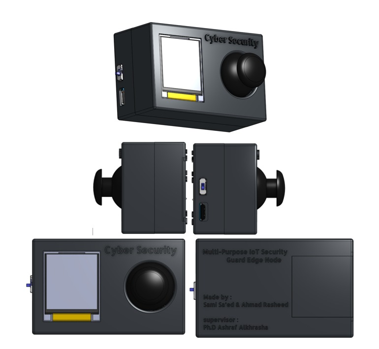
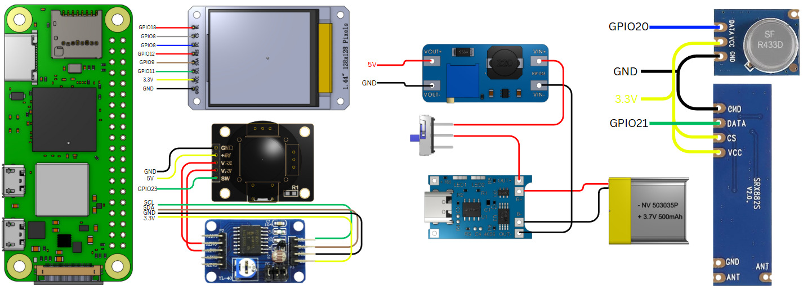
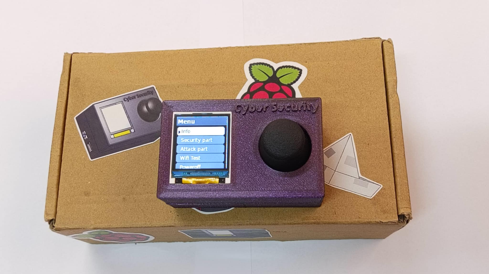

🛡️ IoT-GEN: Multi-Purpose IoT Security Guard Edge Node
IoT-GEN is a robust IoT security edge node designed to simulate, detect, and defend against real-world RF and Wi-Fi attacks. Operating exclusively on the 433 MHz frequency, it integrates attack emulation, signal analysis, and real-time defense mechanisms using Temporal-Statistical RF Frame Filtering. Built on a Raspberry Pi Zero 2W with wireless modules, it offers a compact and powerful solution for IoT security testing.
🔧 Hardware Components

Component
Description

Raspberry Pi Zero 2W
Main controller

128x128 SPI TFT Display
GUI interface (via luma.lcd)

433 MHz RF Receiver (SRX882)
For receiving car key signals

433 MHz RF Transmitter (STX882)
For sending/replaying RF signals

ADS1115 ADC Module
For reading joystick analog values

Joystick Module (analog)
User input navigation

Female-to-male jumper wires
Connections

Breadboard / Soldered PCB
For organizing the circuit

Power Supply (USB)
Powering Pi

📍 Wiring Diagram / GPIO Pinout
Wiring Connections

TFT Display (128x128):
SCK: GPIO11 (SPI Clock)
MOSI: GPIO10
DC: GPIO24
RESET: GPIO25
CS: GPIO8

RF Transmitter (STX882): GPIO20
RF Receiver (SRX882): GPIO21
Joystick via ADS1115 (I2C):
SDA: GPIO2
SCL: GPIO3
VCC: 3.3V
GND: GND

Jamming Detection Pin: GPIO27

⚠️ Note: Ensure all components operate at 3.3V to prevent damage to the Raspberry Pi.
Visuals
Place the wiring diagram in images/wiring.png.
🧠 Project Features
The GUI is divided into four main sections, with all RF operations conducted on the 433 MHz frequency:
1. Intro

Displays a welcome screen with basic project information.

2. Security Features

RF Jamming Detection: Identifies interference on 433 MHz signals.
Capture My RF Key: Captures 24, 32, 64, or 128-bit codes.
Rolling Code Capture: Logs rolling codes transmitted at 433 MHz.
Key Reuse: Replays captured 433 MHz RF signals.

3. Attack Simulation

Fixed Code Cloning on 433 MHz
Rolling Code Cloning on 433 MHz
Passive Keyless Entry Replay Attack
RF Jamming Transmission at 433 MHz

4. Wi-Fi Attack Emulation

Scans WPA/WPA2 networks
Performs Deauthentication attacks
Captures handshake packets
Stores .cap files
Supports password cracking using rockyou.txt

⚙️ How It Works

Interface: Navigate the system using a joystick-controlled GUI.
RF Operations (433 MHz exclusive):
Signals are captured via the SRX882 receiver and decoded in real-time.
Employs Temporal-Statistical RF Frame Filtering to enhance signal accuracy by analyzing temporal patterns and statistical properties of RF frames.
Replay or jamming signals are transmitted via the STX882 transmitter.

Wi-Fi Attacks: Automated Python scripts leverage airodump-ng, aireplay-ng, and aircrack-ng for attack execution.
Storage: Results are displayed on the TFT screen and saved in /storage/.

🖼️ Photos and Diagrams
Create an images/ folder and include:

model.jpg: Photo of the complete hardware setup.
wiring.png: Labeled wiring diagram.
ui_screenshot.png: Screenshot of the GUI on the TFT display.
test_results.jpg: Optional waveform or jamming logs.

Embedding in README
### Hardware Setup

### Wiring Diagram

### CAD Diagram

### Blender

### User Interface

▶️ Usage
# Run the GUI interface on boot
sudo python3 main_gui.py

# Run RF jamming detection
sudo python3 rf_jamming_detect.py

# Run Wi-Fi attack capture
sudo python3 wifi_attack.py

Scripts are located in /scripts/.
Captured keys are stored in /storage/rf_keys/.
Wi-Fi capture files are saved in /storage/wifi_caps/.

📁 Project Structure
IoT-GEN-Security-Node/
├── README.md
├── main_gui.py
├── scripts/
│   ├── rf_capture.py
│   ├── rf_replay.py
│   ├── rf_jamming_detect.py
│   ├── wifi_attack.py
├── storage/
│   ├── rf_keys/
│   └── wifi_caps/
├── images/
│   ├── model.jpg
│   ├── wiring.png
│   ├── ui_screenshot.png
└── requirements.txt

🧩 Future Improvements

Implement an Intrusion Prevention System (IPS) for RF behavior anomaly detection.
Convert the device into an Access Point (AP) for remote security logging.
Expand frequency support to include 315, 868, and 915 MHz alongside 433 MHz.
Encrypt logs and enable secure over-the-air updates.

